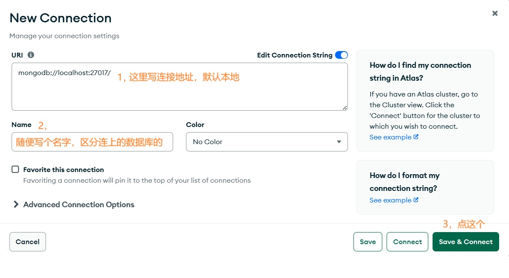
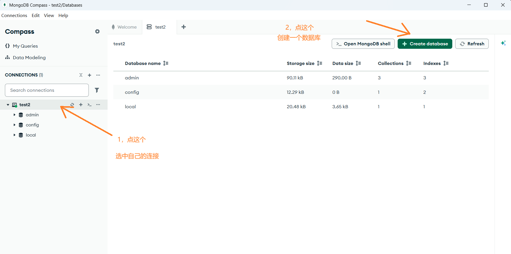
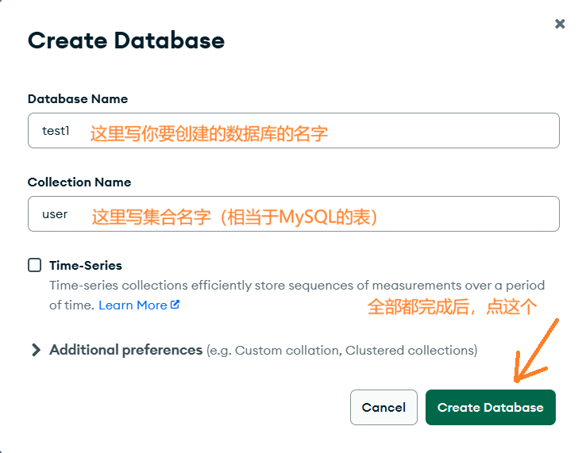
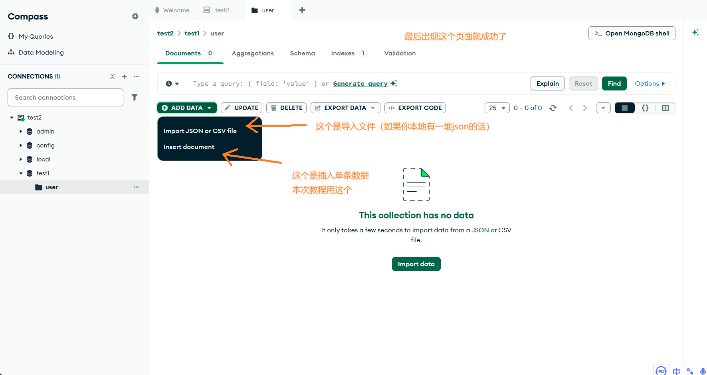
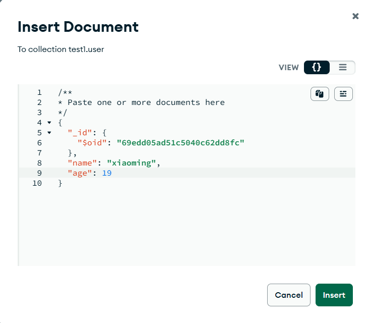
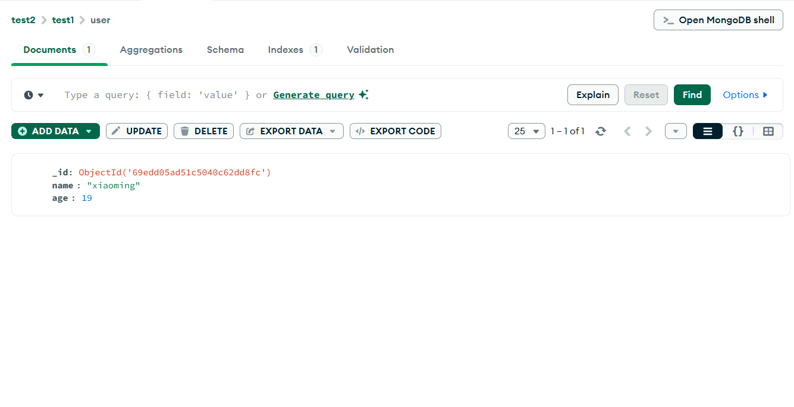

## 🚀 为什么要学习 MongoDB？

自了解了MySQL之后，知道了关系型数据库和非关系型数据库，由于近几天知道了MongoDB，也是非关系型数据库，所以想了解学习一下。<del>其实也因为老师说后面会教非关系型数据库，最近不教，还在学MySQL，所以打算自学了解一下</del>

## 第一步：下载与安装

首先，我们需要下载 MongoDB 的安装包：

📥 [MongoDB Community 下载地址](https://www.mongodb.com/try/download/community)

### 小提醒

- 选择与你的操作系统匹配的版本
- 安装过程中记得勾选 **MongoDB Compass**（图形化管理工具）
- 安装完成后，MongoDB 服务会自动启动

安装完成后，启动 **MongoDB Compass**，连接到本地的 MongoDB 数据库。



> 💡 **小技巧**：如果连接失败，检查一下 MongoDB 服务是否正在运行哦！

---

## 第二步：创建数据库

连接成功后，界面如下图所示。点击按钮开始创建新数据库：



在弹出的对话框中填写：
- **Database Name**：输入数据库名称，例如 `test1`
- **Collection Name**：输入集合名称，例如 `user`



### 概念小课堂

- **数据库（Database）**：相当于一个容器，用来存放多个集合
- **集合（Collection）**：相当于MySQL中的`表`，用来存放文档
- **文档（Document）**：相当于MySQL中的`行`当然理解成`值`也行

---

## 第三步：插入数据

创建完成后，点击 **"Insert Document"** 按钮，开始插入单条数据：



### 数据示例

在 JSON 编辑器中输入如下内容：



```json
{
  "name": "张三",
  "age": 25,
  "email": "zhangsan@example.com",
  "hobbies": ["篮球", "游泳", "编程"],
  "address": {
    "city": "北京",
    "district": "朝阳区"
  }
}
```
> ⚠️ **警告**：如上图所示，把文本粘贴到正确的位置的时候，记得干掉上边例子两边最边缘的`{}`干掉，否则会报错。因为正确写值的地方在下面一点，总之不会的话，参考上面的图即可。


最后，点击 **"Insert"** 按钮完成插入：



### 数据结构特点

- **嵌套结构**：可以直接存储嵌套的 JSON 对象
- **数组支持**：可以直接存储数组类型的数据
- **动态字段**：同一集合中的文档可以有不同的字段


## ✅ 后面的学习打算

- [x] 会持续性的学习MongoDB，了解更多的功能和场景。
- [x] 分享更多心得
- [ ] 学好C/C++

---


如果你在操作过程中遇到任何问题，或者有任何疑问，欢迎在评论区留言交流。祝你学习愉快！