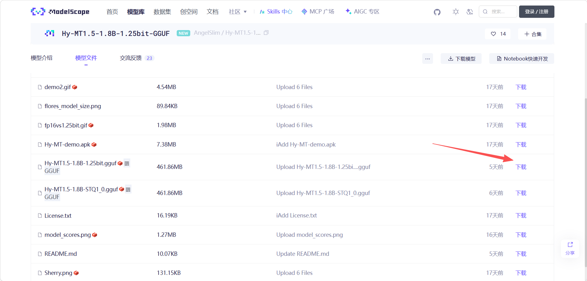
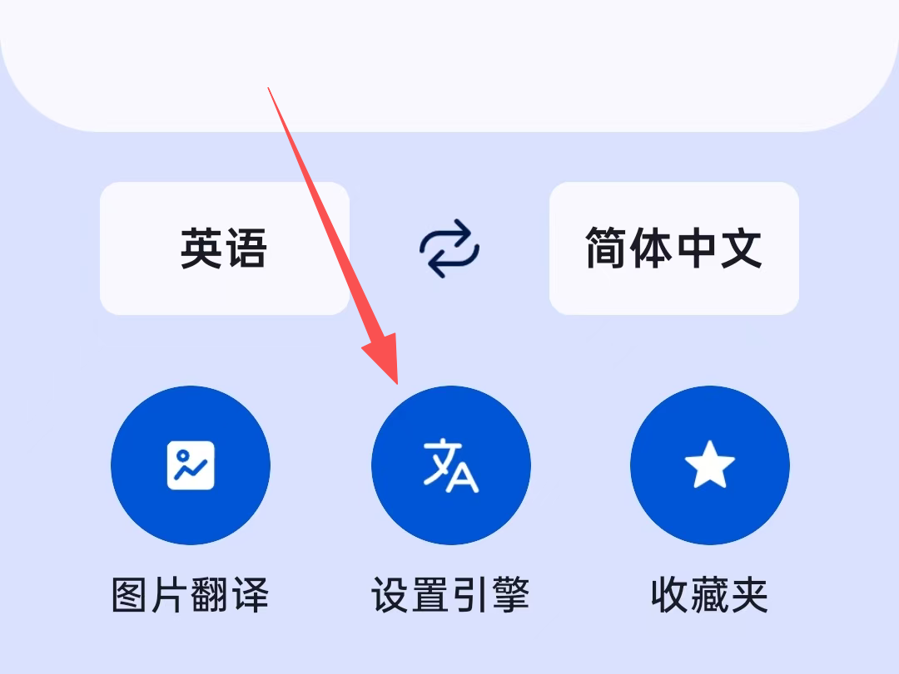
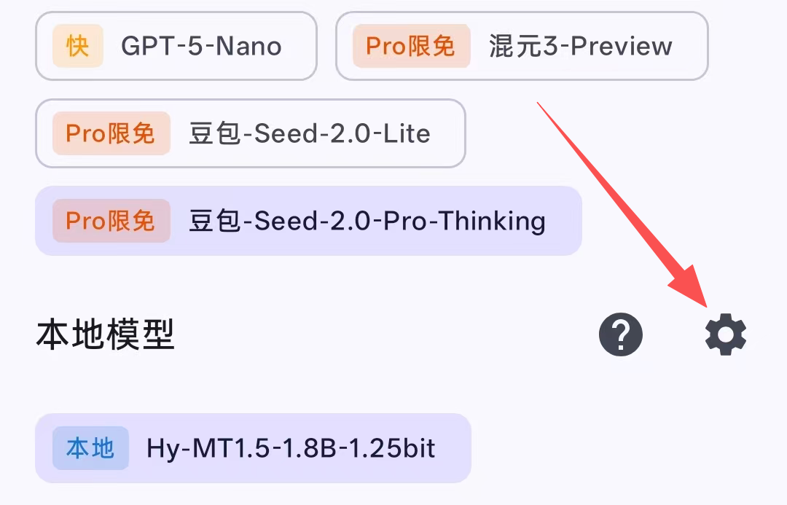
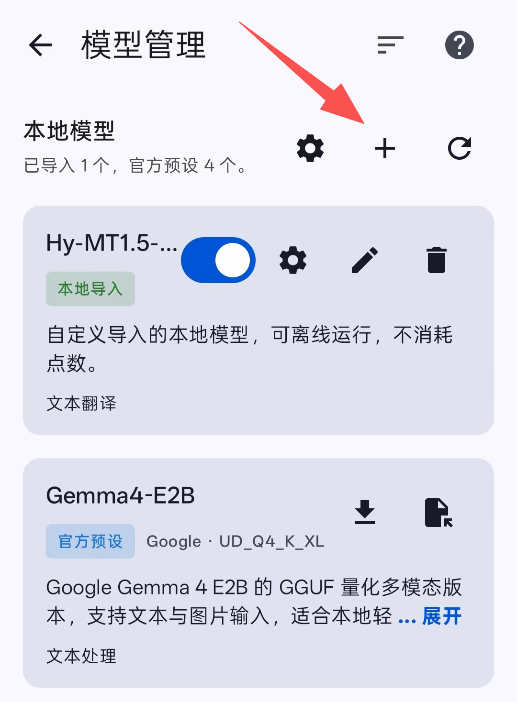
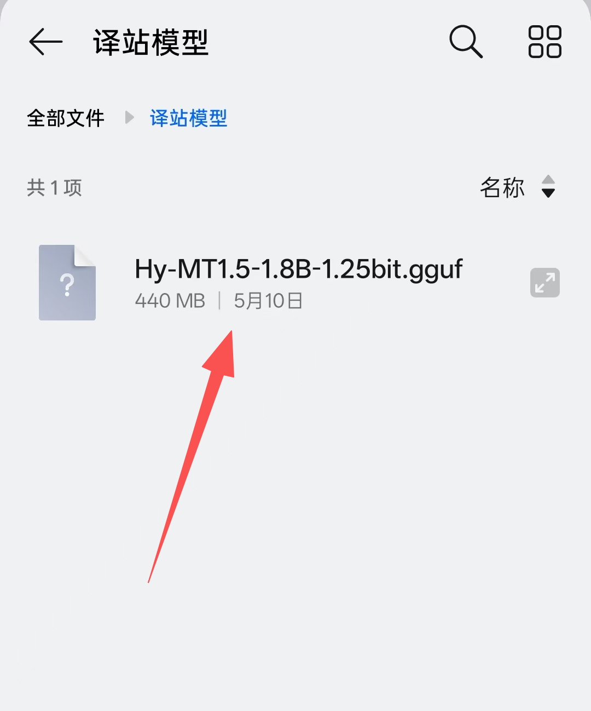
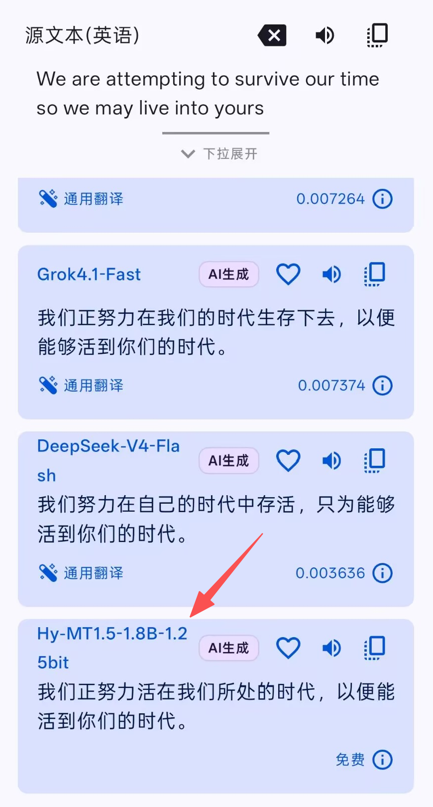

## 工具简介

今天给大家推荐一款轻量好用的翻译工具——**[译站](https://www.funnysaltyfish.fun/trans-new/)**。

译站是一款集合了多种 AI 翻译引擎的开源应用，体积小巧、专注翻译，支持多模型结果对比。其源代码已在 GitHub 开源，欢迎前往 [Transtation-KMP 仓库](https://github.com/FunnySaltyFish/Transtation-KMP) 查看。

---

## 本地部署腾讯 Hy-MT1.5 模型

最近腾讯开源了 **Hy-MT1.5-1.8B-1.25bit** 翻译模型，仅需 **400MB+** 存储空间，翻译效果却非常出色。由于是本地模型，**无需联网、完全免费**。

### 步骤一：下载应用

前往 [译站官网](https://www.funnysaltyfish.fun/trans-new/) 下载 Android 安装包。

### 步骤二：下载模型文件

在 [魔搭社区模型页面](https://www.modelscope.cn/models/AngelSlim/Hy-MT1.5-1.8B-1.25bit-GGUF/files) 下载 `Hy-MT1.5-1.8B-1.25bit.gguf` 文件：

> 💡 **提示**：下载完成后，建议将模型文件移动到易于查找的目录。

### 步骤三：配置模型

1. 打开译站应用，点击 **「设置引擎」**

   

2. 进入 **「模型设置」**

   

3. 点击右上角 **「+」** 添加本地模型

   

4. 在文件选择器中找到并选中下载的 `.gguf` 模型文件

   

5. 确认并**启用该模型**

> ✅ **更新提示**：新版本已支持在「模型管理」界面直接下载 `Hy-MT1.5-1.8B-1.25bit` 模型。如需使用其他 GGUF 格式模型，仍可按上述步骤手动加载。

---

## 效果展示

输入测试文本：

> *We are attempting to survive our time so we may live into yours*

翻译结果：

---

译站让高质量的本地 AI 翻译变得简单可及，推荐有翻译需求的朋友尝试！

